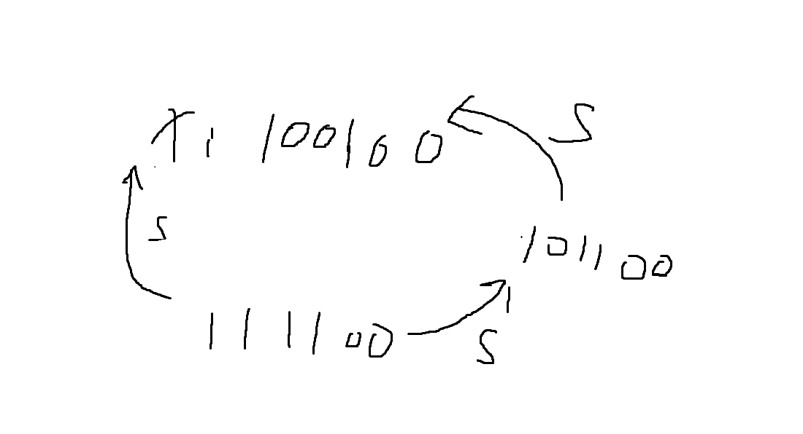

# 牛客周赛 Round 108

竞赛地址: https://ac.nowcoder.com/acm/contest/116658

### A.ICPC World Finals

直接简单判断即可

```c++
void solve()
{
    int a, b, c, d;
    cin >> a >> b >> c >> d;
    if(a < 425 && (b < 60 || c < 60 || d < 60))
    {
        cout << "YES\n";
    }
    else
    {
        cout << "NO\n";
    }
}
```

### B.小苯的数字排序

根据奇偶分别排序并输出

```c++
void solve()
{
    int n;
    cin >> n;
    vector<int> a, b;
    for(int i = 0; i < n; i++)
    {
        int x;
        cin >> x;
        if(x % 2)
        {
            a.push_back(x);
        }
        else
        {
            b.push_back(x);
        }
    }
    sort(a.begin(), a.end());
    sort(b.begin(), b.end());
    for(int i =0; i < b.size(); i++)
    {
        cout << b[i] << " ";
    }
    for(int i =0; i < a.size(); i++)
    {
        cout << a[i] << " ";
    }
    cout << endl;
}
```

### C.小苯的数字合并

其实我们每次的选择都与其他的选择都是无法产生相同的情况，因为元素的大小是大于1的。

并且对于整个数组n，我们可选择的位置有n-1个，每个位置可选可不选，所以一共就有$2^{n-1}$种选择方案，所以我们直接套快速幂的模板就可以解决这道问题。

```c++
const ll mod = 998244353;
//快速幂模板
ll ksm(ll a, ll b, ll p)
{
	ll ans = 1;
	a %= p;
	while(b)
	{
		if(b & 1)
		{
			ans = (ans * a) % p;
		}
		b >>= 1;
		a = (a * a) % p;
	}
	return ans % p;
}
void solve()
{
    int n;
    cin >> n;
    vector<int> a(n);
    for(int i = 0; i < n; i++)
    {
        cin >> a[i];
    }
    cout << ksm(2, n-1, mod) << endl;
}
```

### D.小笨的子序列权值

> AND运算规则：有0为0，全1为1(为什么想题的时候想着想着就忘了)

注意到，想要选择的序列AND起来后是偶数，那么选择的序列中就需要出现偶数，因为只要有0整个序列的权值就是偶数。

所以我们只需要减去全选择了奇数的情况就可以了

```c++
const ll mod = 998244353;
//快速幂模板
ll ksm(ll a, ll b, ll p)
{
	ll ans = 1;
	a %= p;
	while(b)
	{
		if(b & 1)
		{
			ans = (ans * a) % p;
		}
		b >>= 1;
		a = (a * a) % p;
	}
	return ans % p;
}
void solve()
{
    int n;
    cin >> n;
    vector<int> a(n);
    int odd = 0, even = 0;
    for(int i = 0; i < n; i++)
    {
        cin >> a[i];
        if(a[i] % 2)
        {
            odd++;
        }
        else
        {
            even++;
        }
    }
    ll ans = 0;
    //记得模正化
    ans += ((ksm(2, n, mod) - 1) - (ksm(2, odd, mod) - 1) + mod) % mod;

    cout << ans << endl; 
}
```

### E.小笨的有趣数(动态规划/背包问题)

我们可以任意的选择下标进行操作，所以我们的问题是否可以转化为，给你一个sum，把sum分配给n个元素(初始都为0)，求最多可以有多少个有趣数。

可以注意到，我们的答案永远不会小于n-1，因为我们可以全部赋值1，剩余的元素全部给最后一个元素，这样判断最后一个元素是否是有趣数来决定我们的答案是n还是n-1。

但是这样的策略不一定正确，通过打表发现这种有趣数很少，在$n\le100, a_{i}\le200$的情况下我们的总sum不会超过20000，有趣数只有50个左右。

所以我们可以把问题变为，给你一些数字，和一个sum，能否在选择恰好n个数字的情况下凑出sum。这是不是我们经典的背包问题。

考虑使用动态规划，dp[i][j]定义为能否在选择i个数字的情况下，凑出j。

但是这是多组测试，n总和最大可以达到1e6，所以我们直接预处理dp数组，对于每个t，我们直接判断dp[n][sum]即可
```c++
#include <bits/stdc++.h>
using namespace std;
using ll = long long;
vector<vector<int>> dp(110, vector<int>(20010, 0));
// bool squre(int x)
// {
//     int y = sqrt(x);
//     return y * y == x;
// }
// bool check(int x)
// {
//     if(!squre(x))
//     {
//         return false;
//     }
//     int sum = 0;
//     while(x)
//     {
//         sum += x % 10;
//         x /= 10;
//     }
//     return squre(sum);
// }
void init()
{
    vector<int> need = {1, 4, 9, 36, 81, 100, 121, 144, 169, 196, 225, 324, 400, 441, 484, 529, 900, 961, 1521, 1681, 2025, 2304, 2601, 3364, 3481, 3600, 4489, 4624, 5776, 5929, 7225, 7396, 8100, 8836, 9025, 10000, 10201, 10404, 10609, 10816, 11025, 12100, 12321, 12544, 12769, 14400, 14641, 14884, 16900, 17161, 19321, 19600};
    // for(int i = 1; i <= 100; i++)
    // {
    //     int j = i * i;
    //     if(check(j))
    //     {
    //         need.push_back(j);
    //     }
    // }

    dp[0][0] = 1;
    //dp数组含义：用i个元素能否凑出j
    for(int i = 0; i <= 100; i++)
    {
        for(int j = 0; j <= 20000; j++)
        {
            if(dp[i][j])
            {
                for(auto v : need)
                {
                    if(j + v <= 20000)
                    {
                        dp[i+1][j+v] = 1;
                    }
                }
            }
        }
    }
}
void solve()
{
    int n;
    cin >> n;
    int sum = 0;
    for(int i = 0; i < n; i++)
    {
        int x;
        cin >> x;
        sum += x;
    }
    cout << (dp[n][sum] ? n : n - 1) << endl;
}
int main()
{
    ios::sync_with_stdio(false);
    cin.tie(nullptr);
    
    init();
    int t = 1;
    cin >> t;
    while(t--)
    {
        solve();
    }
    return 0;
}
```

### F.AND VS MEX(动态规划/SOS DP(超集DP))

首先我们应该注意到，想要通过AND得到一个x数字，那么我们选择的这些序列在二进制上必定是包含x的，也就是这些序列都是大于等于x的，并且x的每一位不为0的二进制位上，这些序列都不能为0(如果为0，那么就无法得到x)。并且，如果有某个序列可以AND得到x，那么再AND上任意x的超集，结果都是不会改变的。

然后我们就可以想到一个做法，我们可以直接枚举x，看看这个x能否得到，如果可以得到，那么可以继续枚举，如果无法得到，我们可以直接输出x。但是这样的复杂度是$O(n^{2})$的。

考虑使用Sum Of Subset DP(sos DP/超集DP/高维前缀和)，我们可以发现，对于每一个我们想要得到的数字x，我们不一定要枚举全部他的超集，我们只需要枚举恰好多一位的超集就可以了。

为什么呢？

对于一个恰好多一位的超集，我们是不是可以从超集的超集得到，相当于一个传递的过程：

当然前提是超集都要存在

```c++
#include <bits/stdc++.h>
using namespace std;
using ll = long long;
void solve()
{
    ll n;
    cin >> n;
    vector<ll> dp(n + 1, (1ll << 31) - 1);
    //dp[i]表示，i的所有的超集AND起来的结果
    for(int i = 1; i <= n; i++)
    {
        int x;
        cin >> x;
        dp[x] = x;
    }
    for(int i = n; i >= 0; i--)
    {
        for(int bit = 0; bit <= 20; bit++)
        {
            //枚举恰好多一位的超集
            int j = i | (1ll << bit);
            if(j > n)
            {
                continue;
            }
            dp[i] = dp[i] & dp[j];
        }
    }

    for(int mex = 1; mex <= n; mex++)
    {
        if(dp[mex] > mex)
        {
            cout << mex << endl;
            return;
        }
    }
    cout << n + 1 << endl;
}
int main()
{
    ios::sync_with_stdio(false);
    cin.tie(nullptr);
    
    int t = 1;
    cin >> t;
    while(t--)
    {
        solve();
    }
    return 0;
}
```

### END
***